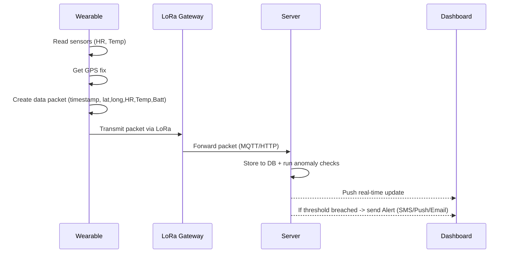

# smart_health_monitoring
t’s an IoT-based wearable/portable system that continuously monitors a person’s vital health parameters (like heart rate, body temperature, pulse rate) along with location tracking (GPS). Using LoRa (Long Range) communication, the collected data can be transmitted over several kilometers to a central monitoring system 


This system is particularly useful in remote health monitoring, elderly care, patient tracking, emergency response, and even soldier health tracking in defense applications.

🔹 Core Components

Sensors

Heart Rate & Pulse Sensor (MAX30100 / MAX30102 / Pulse Sensor) – Detects heartbeat and pulse rate.

Temperature Sensor (LM35 / DS18B20 / MLX90614) – Measures body temperature.

Optional: SpO2 Sensor – Oxygen saturation in blood.

GPS Module (NEO-6M / NEO-M8N)

Provides real-time latitude and longitude for location tracking.

LoRa Module (SX1278 / RFM95W)

Sends health + GPS data wirelessly over 2–10 km range (depends on environment).

Works on low power, making it good for wearable devices.

Microcontroller

ESP32 / Arduino + LoRa shield / STM32 – Collects sensor data, processes it, and transmits via LoRa.

Gateway/Receiver

Another LoRa + MCU setup connected to a PC, Raspberry Pi, or cloud server to collect data.

Dashboard / Mobile App

Displays real-time health readings + location map.

Alerts in case of abnormal values (high fever, irregular heartbeat, SOS).

🔹 Working Principle

Data Acquisition – Sensors measure heart rate, pulse, and body temperature.

Processing – Microcontroller processes signals and prepares them in a structured packet.

Localization – GPS adds latitude & longitude.

Transmission – LoRa sends data to a remote gateway.

Monitoring – Data is displayed on a web app/mobile dashboard.

Alerts – Threshold-based alarms (e.g., if HR > 120 bpm or Temp > 38°C).

🔹 Applications

✅ Healthcare – Remote monitoring of patients, elderly, or post-surgery care.
✅ Military – Track soldiers’ health + location in remote areas.
✅ Disaster Management – Monitor health of rescue workers in real-time.
✅ Sports & Fitness – Athlete health tracking in outdoor training.
✅ Rural Areas – Where WiFi/4G is not available, LoRa provides long-distance health data transmission.

🔹 Example Use Case

Imagine a patient in a rural village wearing this kit:

Sensors record heart rate = 85 bpm, Temp = 37.2°C

GPS adds Lat: 12.9716, Long: 77.5946

Data is sent via LoRa → Gateway → Cloud server

Doctor in the city can view readings in real time.

If patient’s heart rate crosses 150 bpm → system sends emergency alert + GPS location to doctor and family.


Workflow Diagram (Mermaid)
# Smart Health Monitoring & Tracking Kit

## Overview

A compact document that shows a clear **block diagram** and **workflow diagram** for a wearable Smart Health Monitoring Kit using **Heart Rate / Pulse, Temperature, GPS, and LoRa**. Included: data packet format, threshold alerts, recommended components, and power notes.

---

## 1. Components (high level)

* Sensors: Heart-rate / Pulse (MAX30102 or Pulse Sensor), Temperature (DS18B20 / MLX90614)
* GPS: U-blox NEO-6M / NEO-M8N
* LoRa: SX1276 / RFM95W (frequency depends on region)
* Microcontroller: ESP32 (recommended) or Arduino + LoRa shield
* Gateway: LoRa Gateway (single-channel for prototype or multi-channel for production) connected to Raspberry Pi / Server
* Cloud / Server: MQTT broker or HTTP REST endpoint and a database
* Frontend: Web dashboard + Mobile app (map + real-time vitals)

---

## 2. Block Diagram (Mermaid)

```mermaid
flowchart TB
  A[Body-mounted Sensors]
  A1[Heart Rate & Pulse Sensor\n(MAX30102 / Pulse Sensor)]
  A2[Temperature Sensor\n(DS18B20 / MLX90614)]
  A --> A1
  A --> A2

  B[Microcontroller\n(ESP32)]
  A1 --> B
  A2 --> B

  C[GPS Module\n(NEO-6M)]
  C --> B

  D[LoRa Module\n(SX1276/RFM95W)]
  B --> D

  E[LoRa Gateway\n(Raspberry Pi or Commercial Gateway)]
  D -->|LoRa RF| E

  F[Server / Cloud]
  E -->|MQTT/HTTP over Internet| F

  G[Dashboard & Mobile App]
  F --> G

  H[Caretaker / Doctor Alerts]
  F --> H

  style A fill:#f9f,stroke:#333,stroke-width:1px
  style B fill:#bbf,stroke:#333,stroke-width:1px
  style D fill:#bfb,stroke:#333,stroke-width:1px
  style E fill:#ffd,stroke:#333,stroke-width:1px
  style F fill:#fee,stroke:#333,stroke-width:1px
```

---

## 3. Workflow Diagram (Mermaid)



---

## 4. Example Data Packet (JSON)

```json
{
  "device_id": "KIT_001",
  "ts": "2025-09-10T06:30:12Z",
  "gps": {"lat": 12.9716, "lon": 77.5946, "fix": true},
  "heart_rate": 86,
  "pulse": 86,
  "temperature_c": 37.2,
  "battery_mv": 3700
}
```

---

## 5. Thresholds & Alerts (example)

* Heart rate: > 140 bpm (high) or < 40 bpm (low) → Immediate alert
* Temperature: > 38.0 °C → Fever alert
* GPS fail / no fix for > 5 min → Location lost alert
* Battery: < 3.3V → Low battery alert

---

## 6. Recommended Modules & Notes

* **MCU**: ESP32 (has BLE/Wi‑Fi for local provisioning and plenty of compute)
* **LoRa**: RFM95W / SX1278 (check local frequencies: 868MHz EU, 915MHz US/IN)
* **GPS**: NEO-6M (cheap), NEO-M8N (better performance)
* **Sensors**: MAX30102 (heart + SpO2), DS18B20 (temp probe) or MLX90614 (non-contact)
* **Power**: 3.7V Li-ion 500–1500 mAh with boost/regulator (include low-power sleep modes)

---

## 7. Power & Duty Cycle Suggestions

* Sample HR/Temp every 10–30s in normal mode; increase frequency when anomaly detected.
* Use deep sleep on ESP32 between samples; wake for GPS fix intermittently (or use assisted GPS strategy).
* LoRa: keep payload small; use ACKs only for critical packets.

---

## 8. Dashboard Features

* Real-time line charts for HR & Temp
* Map with last known location + breadcrumb trail
* Device list with battery and connection status
* Alerts timeline & SMS/push integration
* Export CSV and historical charts (20–100 sample history)

---

## 9. Prototype PCB & Enclosure Tips

* Separate sensor header for easy replacement
* Shield GPS antenna from metal; provide clear antenna window
* Add 2–3 LEDs for status (power, LoRa TX, GPS fix)
* Use small form factor (wrist strap or chest patch) depending on sensor placement

---

## 10. Next Steps (if you want)

* I can create: 1) a wiring schematic, 2) Arduino/ESP32 prototype code with LoRa packet send, or 3) a sample web dashboard mockup. Tell me which one to build next.

---

*Document created for you — edit or request the next artifact (schematic, code, dashboard) and I’ll add it.*
